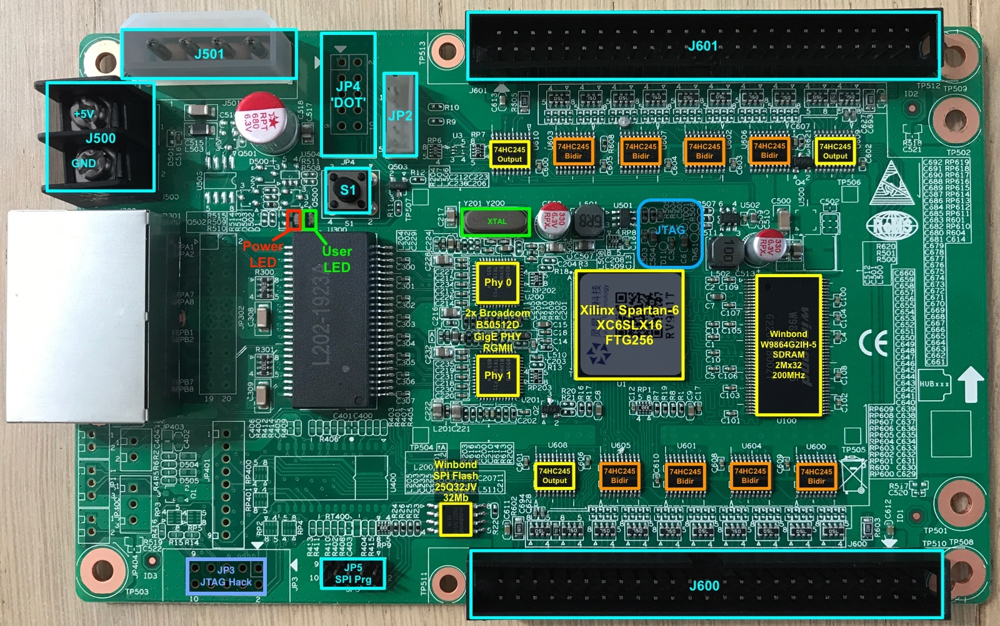

RV901T and ColorLight 5A-75B LED Receiver Cards
===============================================

This repository contains reverse engineering information about the following boards:

* Linsn RV901T HUB75 LED driver card (which uses a Spartan 6 LX16 FPGA)
* ColorLight 5A-75B V6.1 and V7.0 (which use a Lattice ECP5-25 FPGA)

These are known as a "Receiver Card". Its stock function is to receive and forward framebuffer 
data using a proprietary protocol (from a "Sender Card") and blit out control signals to LED panels 
(via shields, like a HUB75 shield).

**Chubby75** is a project to reverse engineer, document and provide tools for these cards. 

Color Light 5A-75B 
------------------

This is a very interesting card because bitstreams for its Lattice ECP5-25 FPGA can be generated
entirely with an open source tool chain (Yosys for synthesis, NextPNR for Place & Route, Project
Trellis for bitstream handling.)

You can find information about it [here](./5a-75b/README.md).

# RV901T LED
------------

You can find information about it [here](./rv901t/README.md).

As it contains a user-reprogrammable Spartan 6 FPGA (LX16, 14k 'logic cells', 9112 LUTs) and 2x GbE, it has 
potential to be usable as a general purpose FPGA development board, an interface card for various purposes, 
or a logic analyzer.

License
-------

[CC0](http://creativecommons.org/publicdomain/zero/1.0/") - to the extent possible under law, the person who associated CC0 with this 
work has waived all copyright and related or neighboring rights to this work.

