# Getting Started With the RV901T Board

The RV901T is a controller board for LED displays, but it's also suitable
for use as an FPGA development board since it has the following:

* Spartan-6 FPGA (XC6LX16),
* Serial flash,
* 64 MBytes of SDRAM,
* Two Gb Ethernet PHYs,
* 25 MHz oscillator,
* Numerous 5V I/O ports,
* A single pushbutton,
* A single LED.

You can find out more about the RV901T at https://github.com/q3k/chubby75
where a group of people are reverse-engineering the board.

This document will provide the information you need to set up the board
for doing FPGA development.

## Getting Access to the FPGA JTAG pins

During development, bitstreams are often downloaded into the FPGA through its JTAG port.
However, the RV901T does not appear to have a physical JTAG port for
attaching a downloading cable, so you'll have to physically modify the board.

The FPGA JTAG pins are brought out to test points on the PCB:

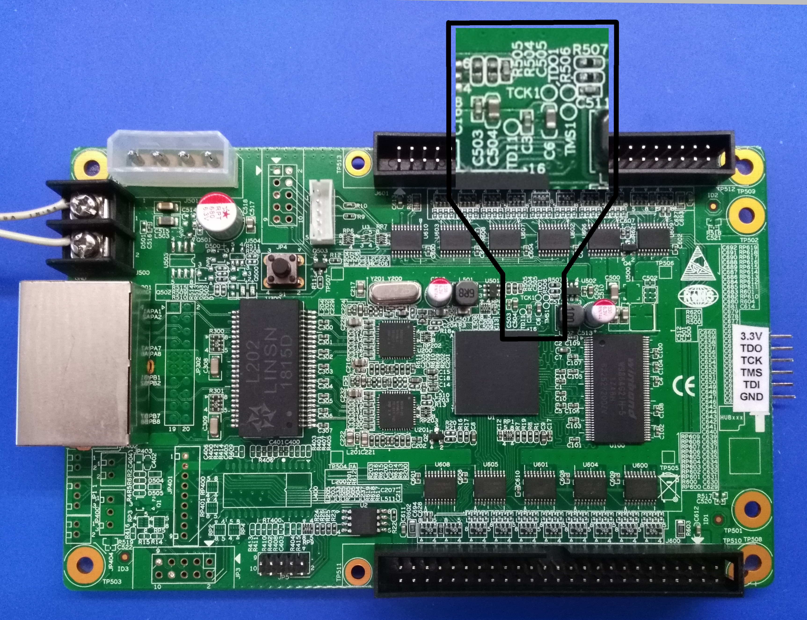

These test points are also available on the back of the PCB.
Unfortunately, they're covered with soldermask.
Using a fine knife-point, you can scrape off the mask and expose the 
test points as shown below:

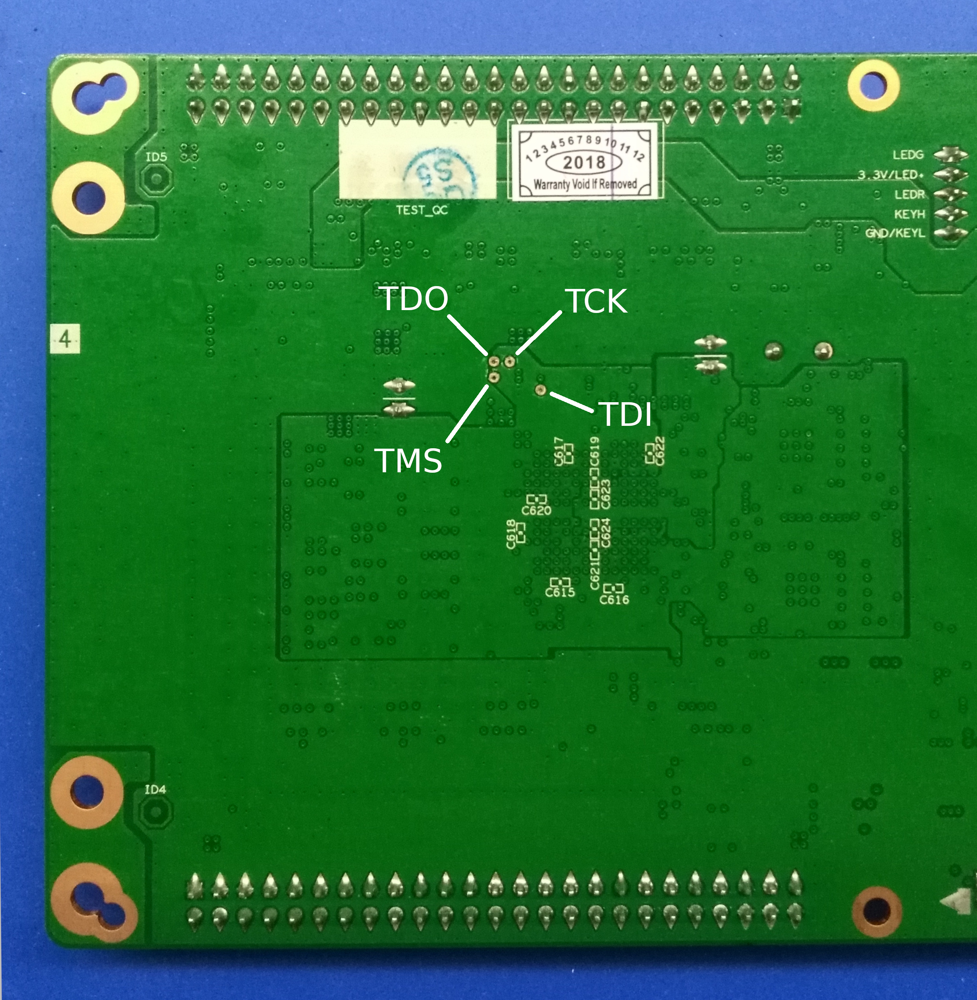

Then, solder the JP3 header to the board and bend the JP3 pin4, 
according to the picture, in order to avoid connect the 5V to the GND 
lines when connecting the JTAG adapter.

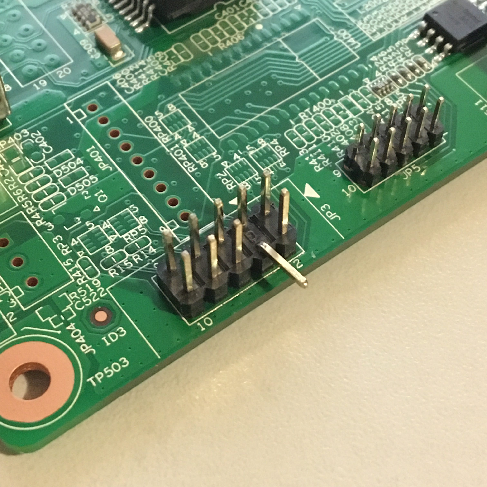

Connect the exposed test points to the JP3 header pins in the solder side:

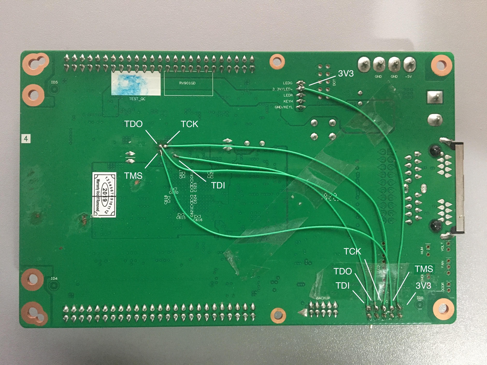

Once that's done, connect the JTAG cable as illustrated:

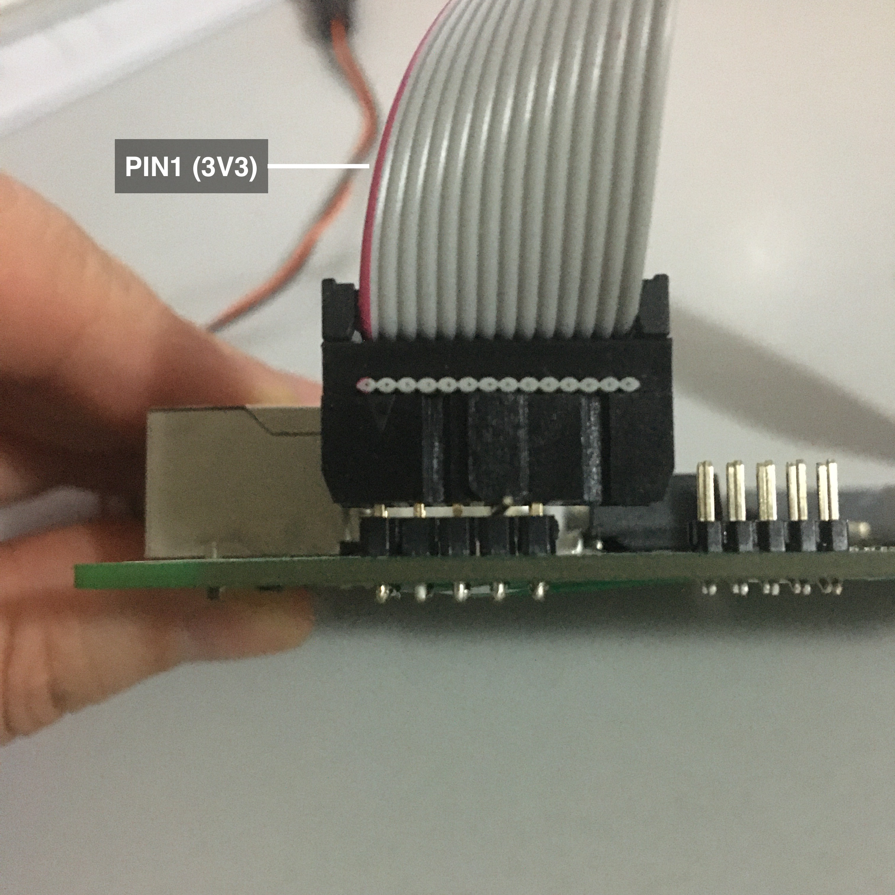

Once that's done, it's a good idea to label the header pins:

Please note that the cable pin-1 (corresponding to the 3V3) 
is not in the same position as the label:

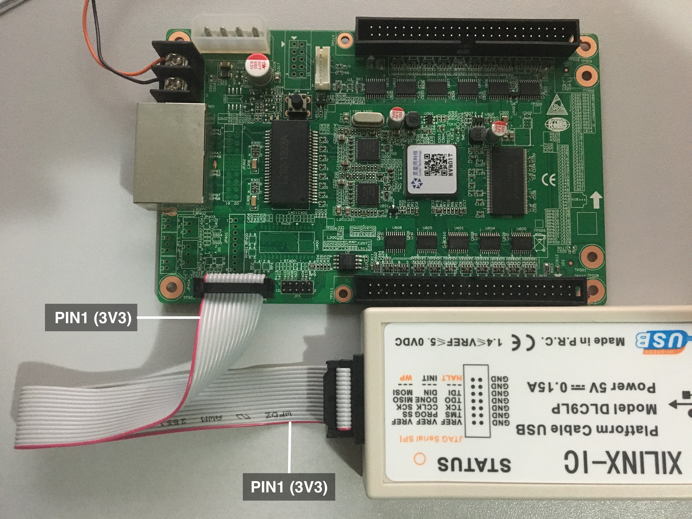

## Applying Power

The board can get power through the screw terminals:

or from a PC power supply through the Molex 8981 connector:

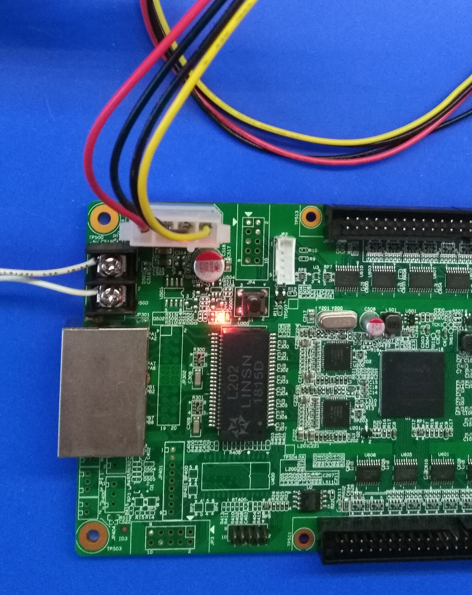

Once power is applied, a red LED will come on.
The nearby pushbutton `S1` will make a green LED turn on and off
as the button is pressed and released.

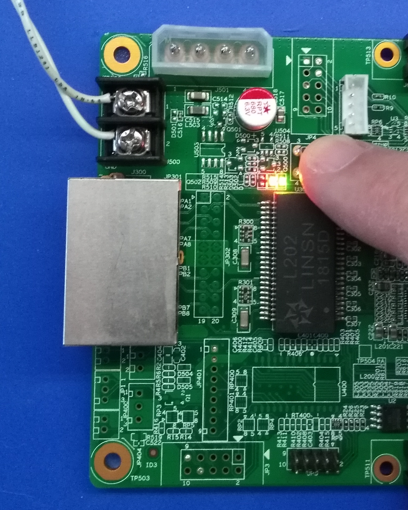

## Testing the JTAG Connection

Attach the downloading cable to the 5x2 header (in my case, I'm using a XILINX Platform Cable chinese clone):

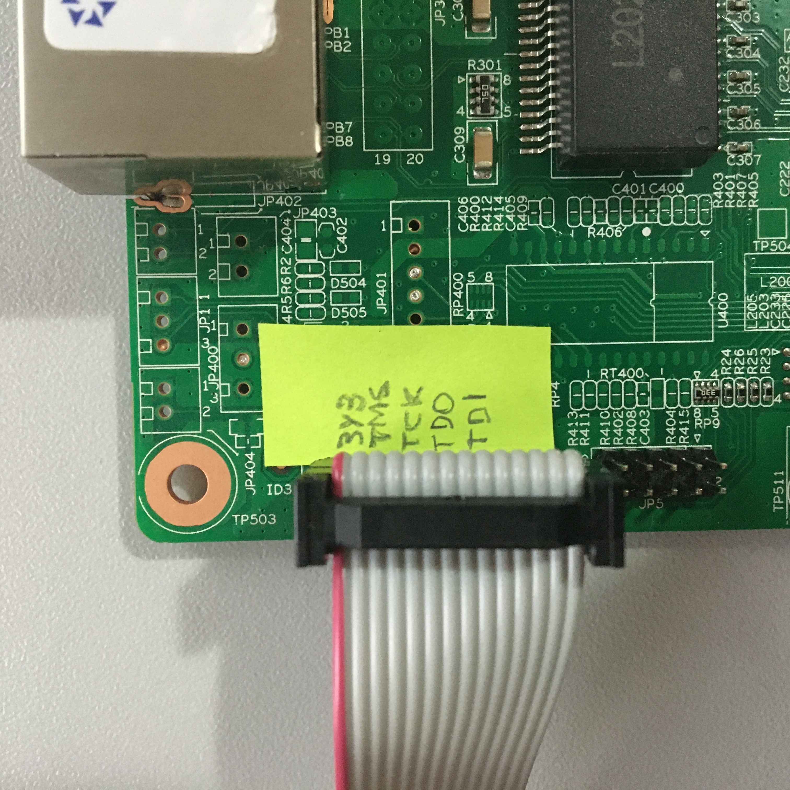

Then apply power to the RV901T board.
The `STATUS` LED on the Platform Cable should turn green.

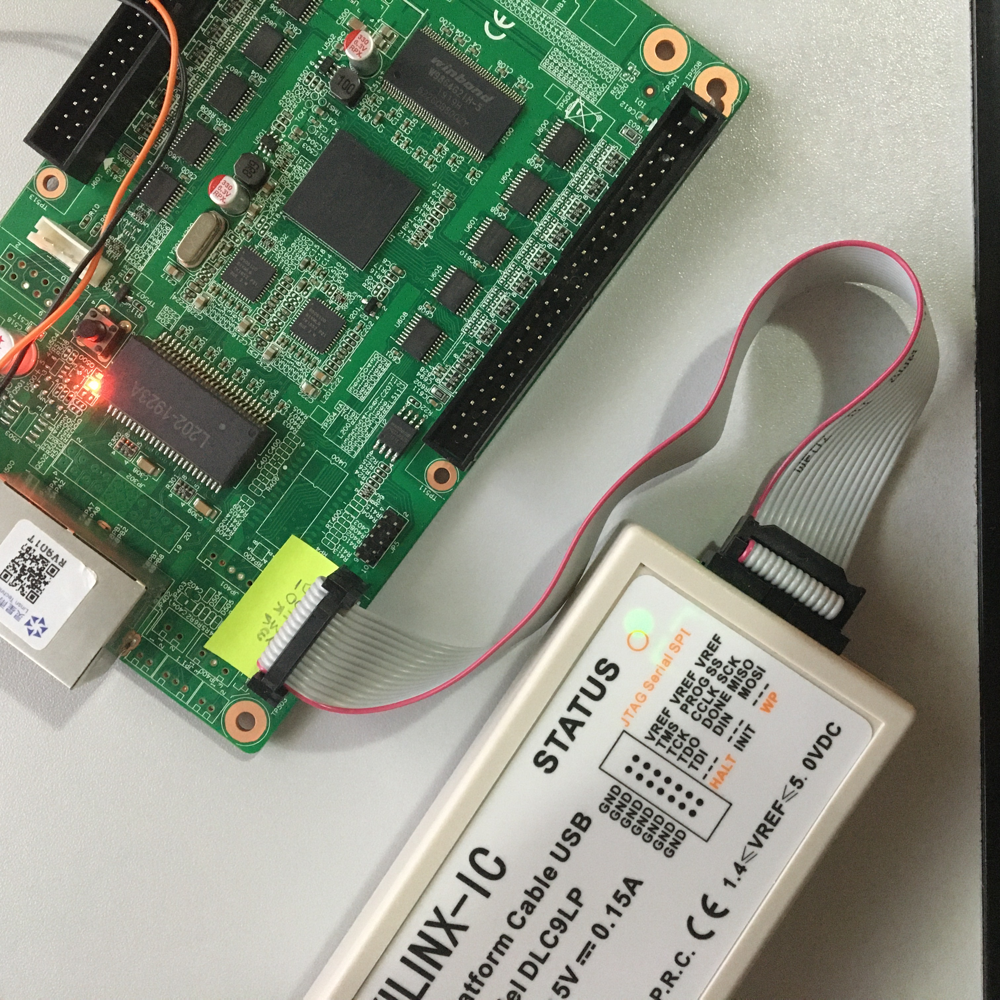

Next, open XILINX ISE (that's the last version of the free XILINX tools
that supports the Spartan-6 FPGAs) and start the `iMPACT` tool:

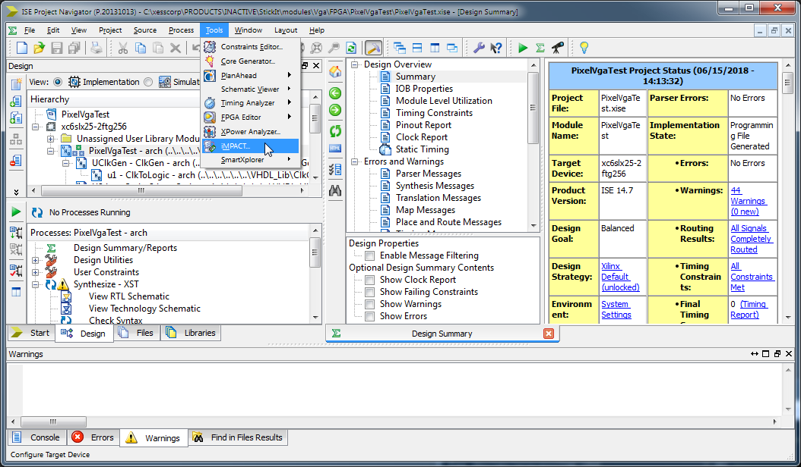

In the `iMPACT` window, double-click the `Boundary Scan` flow:

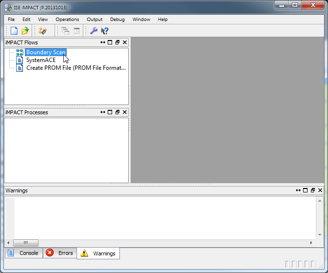

Then, right-click in the `Boundary Scan` tab and select `Initialize Chain`:

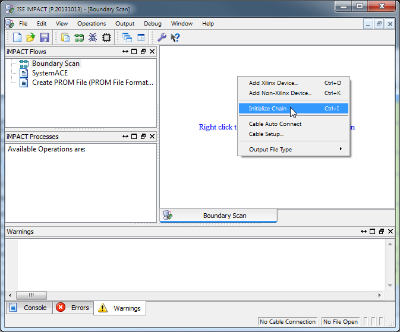

If all goes well, iMPACT should detect the Spartan-6 LX16 FPGA attached to the JTAG header:

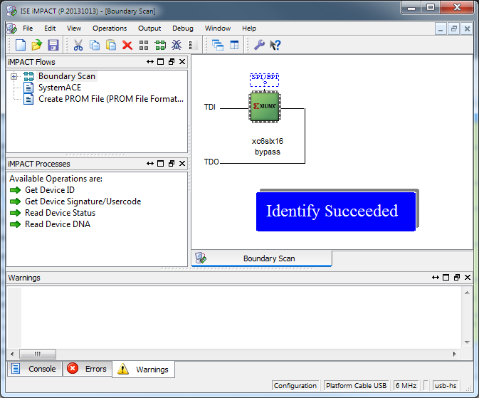

## LED Blink Test

You are now ready to load a custom design in your RV910T.

Let's start load a ready-made bitstream, included in this project, that simply blinks the green 
LED once per second.

* Click on the xc6slx16 FPGA icon in iMPACT. It will turn green if it wasn't already.
* Right click on the FPGA icon and select "Assign New Configuration File"
* Now select `./blink/ise/top.bit'
* When asked "Do you want to attach an SPI or BPI PROM to this device?", answer "No"
* Click again on the xc6slx16 FPGA to turn it green.
* Select "Operations->Program" (or click the corresponding toolbar icon)
* When asked about "Device Programming Properties", just click "Ok"

If all went well, the bitstream will load into the device and your green LED will be blinking! Congratulations!

## Next Steps

Create your own designs!

You can find the pin assignments of the FPGA  [here](https://github.com/q3k/chubby75/blob/master/doc/hardware.md).

